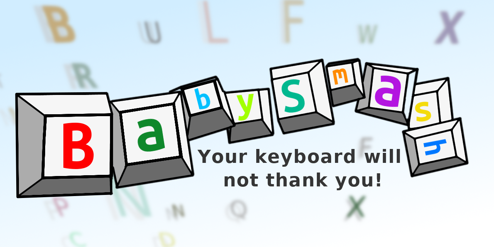

# BabySmash
<p align="center">
  
</p>
A collection of small games that aims to teach letters in a fun way for toddlers. It will ignore most keyboard input and only display keys with letters. So far only one game. 
Type 'quit' to exit the main menu.

If you where looking for 'BabySmash!' by Scott Hanselmann, you'll find it here:
https://www.hanselman.com/babysmash/

## Dependencies
python3-pygame
python3-xlib
python3


## Run
```python3 app.py```
